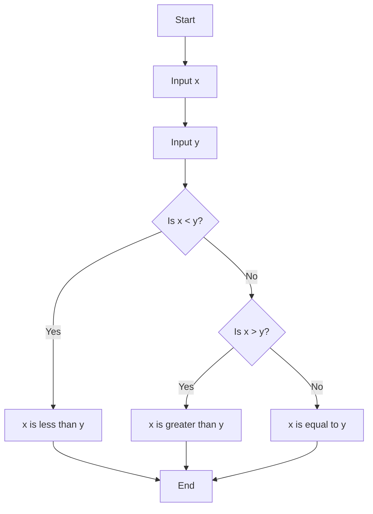

# Loops

its an infinite loop.

```python
i = 3 
while i != 0:
    print("meow")
    i = i - 1
```

# Flowchart... 
... of the loop "meow"



# Data type list

Is like intergers and float's or Bool (boolean expression) Python also has list. a list of things in real world is a list of things in Python.

    interger or float - it represents or outputs numbers.

    boolean represents 'true' or 'false' - 0 < 1

    lists are items which can be different data types. It can contain strings or intergers.
```python
mixed_list = [1, "apple", 3.14, True]
```

