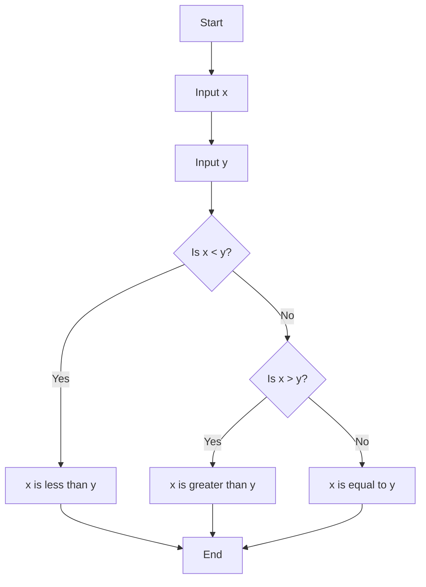
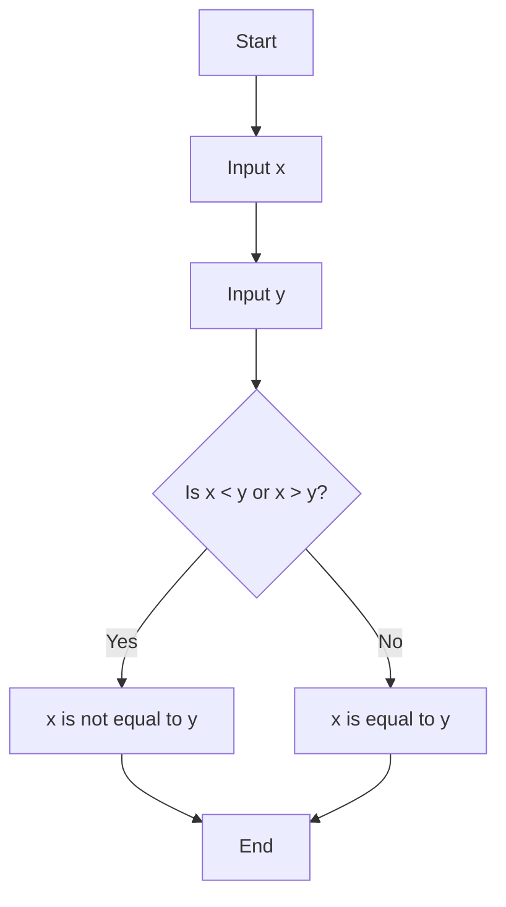

# Conditionals with Python

are this ability to ask questions and answers those questions, in order to decide do you want to execute this line of code? Or this linbe of code instead?
They allow you to take the proverbial forks in the road, within your own code, logically.

simbols to ask questions:
```python
>  ## greater than...
>=  ## greater than or equal to...
<  ## less than...
<= ## less than or equal to...
==  ## represents quality single = represents assignment...
!=  ## represents not equal to...
```
we are going to need other keywords to ask questions
```python
if ## if the answer to this question is true, then go ahead and execute this code for me.
```
an other proposition. technically you can use only 'if' because hardware got faster you wont notice the differance but by improving your code laying better foundation for writing better code long term(writing bigger faster programms)
```python
elif  
```
final form lol
```python
else
```

example:
```python
x = int(input("What's x? "))
y = int(input("Whats' y? "))

if x < y:  ## this is so called boolean expression (named after mathematician Bool)
    print("x is les than y") 
elif x < y:
    print("x is greater than y")
else:  ## x == y: you dont need to write down that x equals y because logically if first two false than x is equals to y.
    print("x is equals to y")
```
# Flowchart for the Python Code
'remember flowchart with 3 if's arguments(stright line)'



question or
```python
or
```
Example:
```python
x = int(input("What's x? "))
y = int(input("What's y? "))

if x < y or x > y:
    print("x is not equals to y")
else:
    print("x is equal to y")
```

more simplier version

Example:
```python                     ## second version
x = int(input("What's x? "))  ## x = int(input("What's x? "))
y = int(input("What's y? "))  ## y = int(input("What's y? "))

if x != y:                          ## if x == y:
    print("x is not equals to y")   ## print("x is equal to y")
else:                               ## else:
    print("x is equal to y")        ## print("x is not equals to y")
```

# Flowchart for the Python Code


Question 'and'

```python
and
```