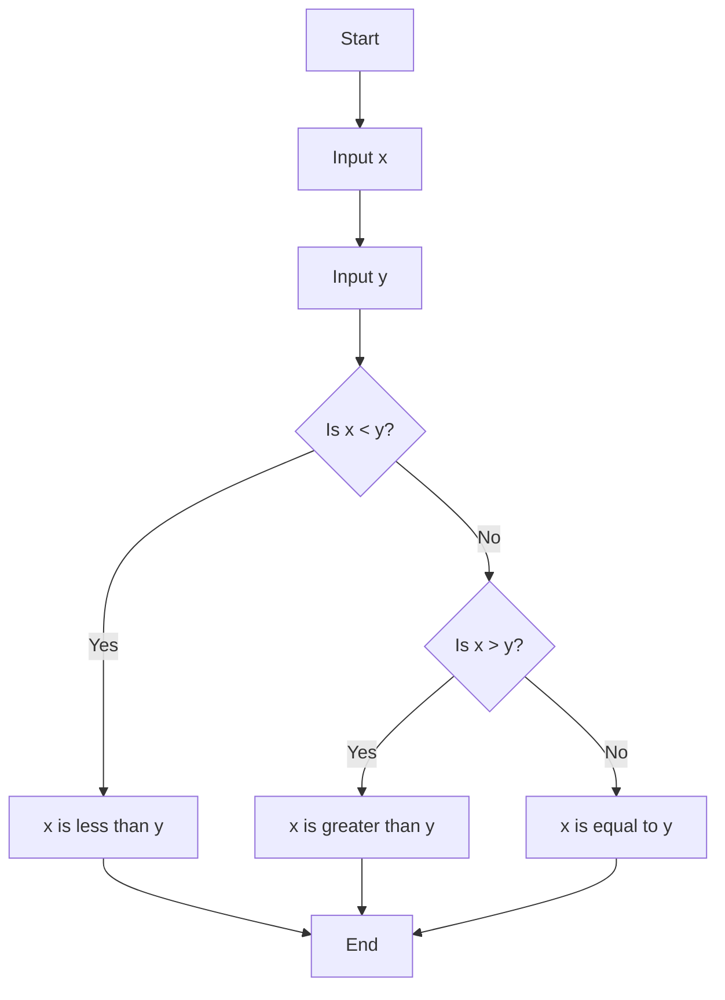
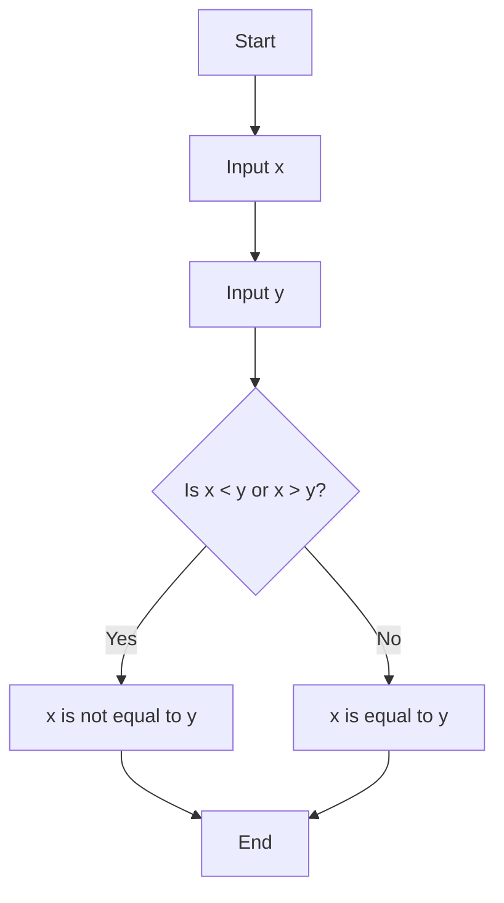

# Conditionals with Python...

...are this ability to ask questions and answers those questions, in order to decide do you want to execute this line of code? Or this linbe of code instead?
They allow you to take the proverbial forks in the road, within your own code, logically.

```python
if condition:
    # Code to execute if condition is True
elif another_condition:
    # Code to execute if another_condition is True
else:
    # Code to execute if no previous conditions were True
```

Symbols to ask questions:

    '>'  Greater than...
    '>='   Greater than or equal to...
    '<'   Less than...
    '<='  Less than or equal to...
    '=='   Represents quality, single = represents assignment...
    '!='   Represents not equal to...

    '+'  Addition
    '-'  Subtraction
    '*'  Multiplication
    '/'  division
    '%'  modulo or remainder 2 / 3 = 2

We are going to need other keywords to ask questions
```python
if ## if the answer to this question is true, then go ahead and execute this code for me.
```
an other proposition. technically you can use only 'if' because hardware got faster you wont notice the differance but by improving your code laying better foundation for writing better code long term(writing bigger faster programms)
```python
elif  
```
final form lol
```python
else
```

example:
```python
x = int(input("What's x? "))
y = int(input("Whats' y? "))

if x < y:  ## this is so called boolean expression (named after mathematician Bool)
    print("x is les than y") 
elif x < y:
    print("x is greater than y")
else:  ## x == y: you dont need to write down that x equals y because logically if first two false than x is equals to y.
    print("x is equals to y")
```
# Flowchart for the Python Code
'remember flowchart with 3 if's arguments(stright line)'



Question 'or'
Used to combine conditions. If either condition is true, the entire expression evaluates to true.

```python
or
```
Example:
```python
x = int(input("What's x? "))
y = int(input("What's y? "))

if x < y or x > y:
    print("x is not equals to y")
else:
    print("x is equal to y")
```

More simplier version

Example:
```python                     ## second version
x = int(input("What's x? "))  ## x = int(input("What's x? "))
y = int(input("What's y? "))  ## y = int(input("What's y? "))

if x != y:                          ## if x == y:
    print("x is not equals to y")   ## print("x is equal to y")
else:                               ## else:
    print("x is equal to y")        ## print("x is not equals to y")
```

# Flowchart for the Python Code


Question 'and'
Used to combine conditions. Both conditions must be true for the entire expression to evaluate to true.

```python
and
```
# grade.py

```python                                            
score= int(input("Score: "))          

if score >= 90 and score <= 100:  
    print("Grade: A")         
elif score >= 80 and score < 90:   
    print("Grade: B")         
elif score >= 70 and score < 80:  
    print("Grade: C")   
elif score >= 60 and score < 70: 
    print("Grade: D") 
else:   
    print("Grade: F")
```

# Boolean Values (bool can only be true or false)
In Python, boolean values are True and False. They are often used in conditional statements and logical operations.
```python
is_tall = True
is_short = False
```

# Match and Case
The match statement, introduced in Python 3.10, provides a more powerful and flexible way to handle conditional logic compared to traditional if statements. It's similar to switch-case statements in other languages.
```python
def get_grade(score):
    match score:
        case score if score >= 90:
            return "A"
        case score if score >= 80:
            return "B"
        case score if score >= 70:
            return "C"
        case score if score >= 60:
            return "D"
        case _:
            return "F"
```
graph TD
    A[Start] --> B[Input score]
    B --> C{Score >= 90?}
    C -->|Yes| D["Grade: A"]
    C -->|No| E{Score >= 80?}
    E -->|Yes| F["Grade: B"]
    E -->|No| G{Score >= 70?}
    G -->|Yes| H["Grade: C"]
    G -->|No| I{Score >= 60?}
    I -->|Yes| J["Grade: D"]
    I -->|No| K["Grade: F"]
    D --> L[End]
    F --> L
    H --> L
    J --> L
    K --> L

